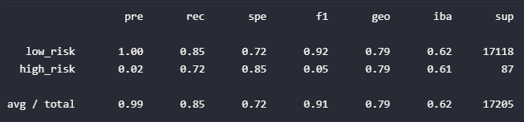
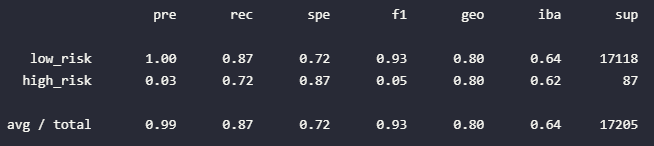
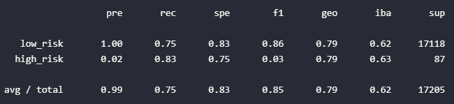
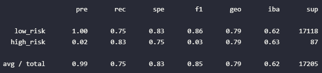
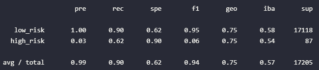
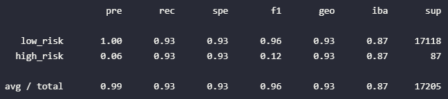

# credit-risk-analysis
Data Analysis Bootcamp - Week 17

## Overview

The purpose of this was to look at a labeled credit risk dataset and see if we could use some combination of resampling and supervised machine learning techniques to generate a good model for predicting whether someone will be a low or high risk loan based on specific features.

## Resources

- [credit risk 2019 zip](resources/LoanStats_2019Q1.zip)

## Results

Using bulleted lists, describe the balanced accuracy scores and the precision and recall scores of all six machine learning models.

1. Logistic regression with random oversampling. 
    - The balanced accuracy score is 0.79, the precision of the high_risk category is 0.02 and the recall of the high_risk category is 0.72.
    - 

2. Logistic regression with SMOTE oversampling
    - The balanced accuracy score is 0.80, the precision of the high_risk category is 0.03 and the recall of the high_risk category is 0.72.
    - 

3. Logistic regression with Cluster Centroids undersampling
    - The balanced accuracy score is 0.79, the precision of the high_risk category is 0.02 and the recall of the high_risk category is 0.83.
    - 

4. Logistic regression with SMOTEENN resampling
    - The balanced accuracy score is 0.79, the precision of the high_risk category is 0.02 and the recall of the high_risk category is 0.83.
    - 

5. Balanced Random Forest Ensemble Method
    - The balanced accuracy score is 0.76, the precision of the high_risk category is 0.03 and the recall of the high_risk category is 0.62.
    - 

6. Easy Ensemble Classifier Method
    - The balanced accuracy score is 0.93, the precision of the high_risk category is 0.06 and the recall of the high_risk category is 0.93.
    - 

## Summary

With all of these, the balanced accuracy score seems decent at first glance, but that is mostly due to the size fo the "low_risk" class completely dwarfing the "high_risk" class, which is the class we're actually looking to predict. While the easy ensemble classifier did the "best" I wouldn't really recommend using any of these in practice. A high recall means that we're doing a good job at capturing every high risk loan and making sure they aren't offered one, but an incredibly low precision means that there are a lot of people being denied when they're actually a safe person to lend to. Both denying them the cash they need at the time, and denying the company the chance to make interest. While we want a high recall to avoid giving out too many loans destined for default I would want either more data or more time with different models and sampling methods to see if we can get the precision up.